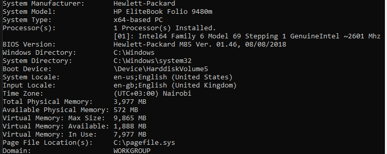
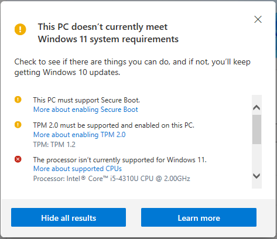
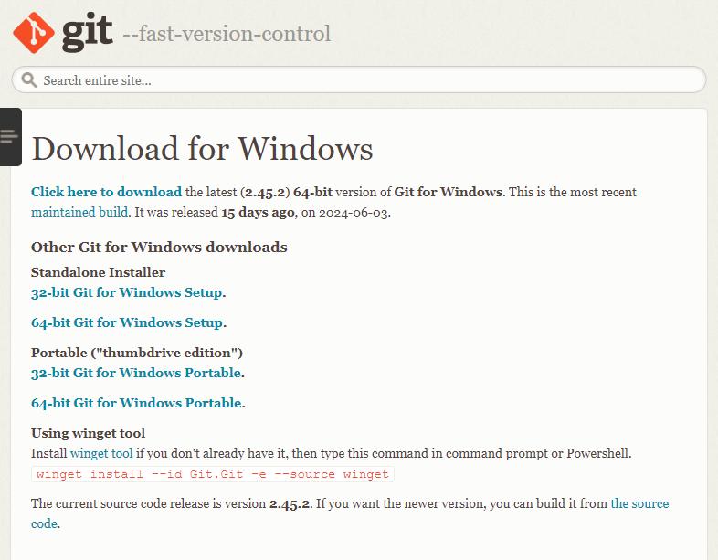
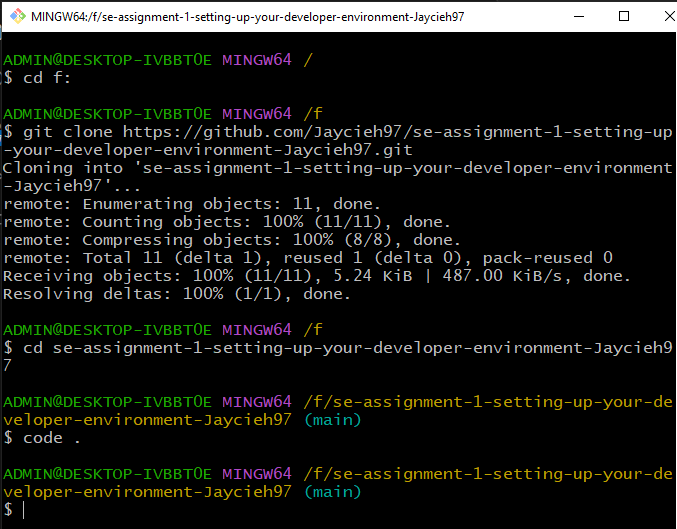
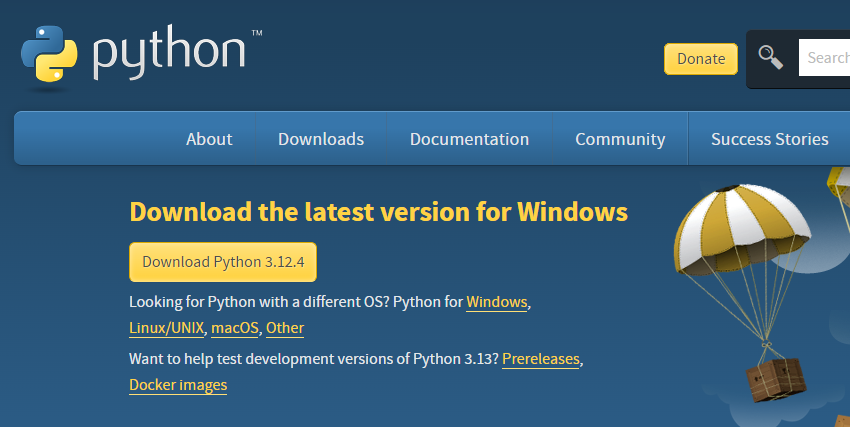

# Dev_Setup
Setup Development Environment

#Assignment: Setting Up Your Developer Environment

#Objective:
This assignment aims to familiarize you with the tools and configurations necessary to set up an efficient developer environment for software engineering projects. Completing this assignment will give you the skills required to set up a robust and productive workspace conducive to coding, debugging, version control, and collaboration.

#Tasks:

1. Select Your Operating System (OS):
   Choose an operating system that best suits your preferences and project requirements. Download and Install Windows 11. https://www.microsoft.com/software-download/windows11

   i have a windows operating system with windows 10 installed and i checked its specifications through command prompt to see if they can acommodate windows 11 as shown in the picture.
   
   also, using the PC health Check, i confirmed that my PC is not eligible for windows 11 as shown in the picture below.
   
   if i were to download a windows 11, i would go to https://www.microsoft.com/software-download/windows11 and use the option of windows 11 installation assistant to download.
   after the download is complete, i will open the downloaded windows 11 in folder  and run as adminstrator, to open. there will be a confimartion if my pc hardware is compatible, then prompted to accept the terms and install.
   A restart now button pops up to complete the installation process. the restart can happen a few times before full installation so i am required not to turn off my computer. and that is basically how to install windows 11 on my PC

2. Install a Text Editor or Integrated Development Environment (IDE):
   Select and install a text editor or IDE suitable for your programming languages and workflow. Download and Install Visual Studio Code. https://code.visualstudio.com/Download 

   to install visual studio code as my IDE, i will follow the link provided.
   once in the site, i will look for the suitable download for my windows OS then click to download my VS code. 
   once downloaded, i locate the file in the downloads folder and click to open the installer.
   once opened, i read, agree and click to accept the terms offered the click the NEXT prompt.
   i will choose the location folder where i want my vs code installed, which is the default location for me. i again click the NEXT prompt which takes me to add additional tasks to my vs code such as creating a desktop icon and adding to path. i select these and click NEXT where i am prompted to INSTALL. once i finish installing , i launch my vs code to install the extentions needed such as python, prettier, dart and modify my preference like changing to dark theme.

3. Set Up Version Control System:
   Install Git and configure it on your local machine. Create a GitHub account for hosting your repositories. Initialize a Git repository for your project and make your first commit. https://github.com

using the link https://git-scm.com/download/win, i download 64-bit git for windows.

 then go to downloads, right click to open in folder. copy the link address so as to add to path, if not already there in the environment variables. after ensuring its path has been added, go back to folder, right click and open git to set up. once its launched, click NEXTs, leaving everything in default and at the end click INSTALL then click FINISH. at this point, git is ready to configure.
 to configure, open GIt from the start menu as an adminstrator. set name using git config --global user.name "Your Name" and email using 
git config --global user.email "your.email@example.com" this same email will be used to link git to my github. to ensure that the name and email have been set successfully, i will use git config --list, to verify the success of my settings.
then i will create a github account in github.com using the same email as in git and choose a username of my choice.
to verify if the two accounts have been linked successfully, i will create a repository in my github and copy code link, then open my gitbash, create a folder where i want my work stored, then clone the repository using the copied link code. i then cd my repo, open a readme.md file in vs code through code . as shown in the picture. 
 once in vs code, i will do whatever needs to be done to my project. when done, i will open a new gitbash terminal. in gitbash i will git add, git commit a message of what i have done, then git push  origin main or master depending on my branch. i will go back to github and refresh my page to see changes that have been made to my readme file as in the picture

4. Install Necessary Programming Languages and Runtimes:
  Instal Python from http://wwww.python.org programming language required for your project and install their respective compilers, interpreters, or runtimes. Ensure you have the necessary tools to build and execute your code.

i download python  for my windows from http://wwww.python.org 
once its downloaded, i open it to start installation. for installation, i will check to add to path to make it accessible from the command line.
i will leave everything else on default, and  click NEXT. for the advanced features i will check install for all users and then click install at the end.
to ensure that my python has installed successfully, i will check if its been added in the path in environment variables. i will also open gitbash and type the command python --version to see if the version downloaded is the one installed.
i will also download both my virtual environment and requests packages using pip

5. Install Package Managers:
   If applicable, install package managers like pip (Python).

   pip is a python package and therefore to install pip, we first need to ensure python is installed already. open gitbash and verify the python that is in place through the command python --version
   then call python to install pip through 'python get pip.py to installl pip'. finally verify if pip  has been successsfully installed thruogh the command 'pip --version'.

6. Configure a Database (MySQL):
   Download and install MySQL database. https://dev.mysql.com/downloads/windows/installer/5.7.html

i will visit MySQL download page to download  MYSQL version suitable fo my windows OS. i will forego the prompt to  sign in for an oracle account  and just start my download.
once MYSQL is downloaded, i will open the installer to start set up, i will choose  to install developer default  and click NEXT, then EXECUTE. at this stage, all selected products will be  installed.
To configure  MYSQL Server, i will choose the standalone MYSQL server and click next. i tgen will select the development computer and leave the default port then click next. i will be prompted to create a root password  which i will do and click next since i don't have any additional account to add. i will then configure MYSL as a windows service and ensure i check the Start MYSQL at system startup to ensure that MYSQL starts every time  the computer starts. i will click nest and excexute to aply the settings and once its done, click finish. this the final stage of installing MYSQL.

7. Set Up Development Environments and Virtualization (Optional):
   Consider using virtualization tools like Docker or virtual machines to isolate project dependencies and ensure consistent environments across different machines.

8. Explore Extensions and Plugins:
   Explore available extensions, plugins, and add-ons for your chosen text editor or IDE to enhance functionality, such as syntax highlighting, linting, code formatting, and version control integration.

   my IDE is visual studio code and the extentions i need to enhance my funtionality is python, pylance  anf version control system like gitbash.

9. Document Your Setup:
    Create a comprehensive document outlining the steps you've taken to set up your developer environment. Include any configurations, customizations, or troubleshooting steps encountered during the process. 

    i have done this in the steps before this question.

#Deliverables:
- Document detailing the setup process with step-by-step instructions and screenshots where necessary.
- A GitHub repository containing a sample project initialized with Git and any necessary configuration files (e.g., .gitignore).
- A reflection on the challenges faced during setup and strategies employed to overcome them.

#Submission:
Submit your document and GitHub repository link through the designated platform or email to the instructor by the specified deadline.

#Evaluation Criteria:**
- Completeness and accuracy of setup documentation.
- Effectiveness of version control implementation.
- Appropriateness of tools selected for the project requirements.
- Clarity of reflection on challenges and solutions encountered.
- Adherence to submission guidelines and deadlines.

Note: Feel free to reach out for clarification or assistance with any aspect of the assignment.
